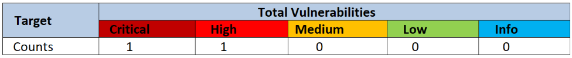

# Jio-Things-Application-VAPT
This repository contains a detailed list of all the vulnerabilities, found accorss the JIO Things mobile application by the security team at FEV LTD.

# Table of Contents

1. [Introduction](#introduction)
    - [Overview](#overview)
2. [Summary](#summary)
3. [Detailed Description of the Vulnerabilities and Findings](#detailed-description-of-the-vulnerabilities-and-findings)
    - [Vulnerabilities](#vulnerabilities)
        - [Hardcoded secrets : Send False Notification to All Users on the Platform](#hardcoded-secrets-send-false-notification-to-all-users-on-the-platform)
        - [Account Takeover: Access to Any User Account](#account-takeover-access-to-any-user-account)

## Introduction
The JioThings application is a comprehensive platform for managing IoT devices, offering users control over smart home appliances, security cameras, and environmental sensors. With its user-friendly interface and seamless integration, JioThings provides convenient access to real-time device monitoring and automation features.

### Overview
A security evaluation was conducted on the application to pinpoint possible weaknesses that could be exploited by adversaries in real-world scenarios, aiding the company in defending against cyber attacks of any nature.

## Summary

Total of 02 risks were identified during the test.

  
   
  <em>Summary of Vulnerabilities</em>

  
   
  <em>GraphicalRepresentation.png</em>

## Detailed Description of the Vulnerabilities and Findings

### Vulnerabilities

#### Hardcoded secrets: Send False Notification to All Users on the Platform
#### CVE-2024-25271

#### Account Takeover: Access to Any User Account
#### CVE-2024-24143

## Pentesters
 - **Aarav Sinha** [https://in.linkedin.com/in/aarav-sinha-749047159](#)
 - **Vaishali Nagori** [https://in.linkedin.com/in/vaishali-nagori](#)
